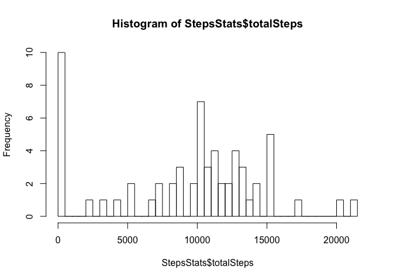
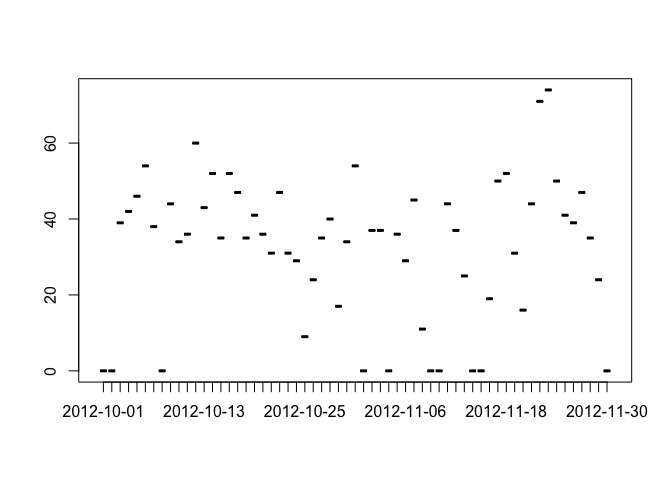

# Reproducible Research: Peer Assessment 1


## Loading and preprocessing the data

## Download Data
Assignment is supposed to analyze data that is available on [Activity monitoring data](https://d396qusza40orc.cloudfront.net/repdata%2Fdata%2Factivity.zip). 

```r
download.file("https://d396qusza40orc.cloudfront.net/repdata%2Fdata%2Factivity.zip","activity1.zip",method="curl")
unzip(zipfile="activity1.zip",overwrite=TRUE)
```

## Loading and Processing Data

```r
activity <- read.csv("activity.csv")
##summary(activity)
##str(activity)
## assign 0 to NA as NA might suppress the right data info too
activity$steps[is.na(activity$steps)] <- 0
## since we have to summarize data, it is better to use dplyr package. here is how we will load the library
library(dplyr)
```

```
## 
## Attaching package: 'dplyr'
## 
## The following object is masked from 'package:stats':
## 
##     filter
## 
## The following objects are masked from 'package:base':
## 
##     intersect, setdiff, setequal, union
```

## What is mean total number of steps taken per day?

Since we have to ignore the missing values for this part of the assignment, we will simply calculate the mean  


```r
StepsStats <- activity %>%
         group_by(date) %>%
         summarize(mean(steps),sum(steps),median(steps))
## Please we have calculated mean,total steps per day and median in the same step. To rename the columns properly use the following code
colnames(StepsStats) <- c("date","mean","totalSteps","median")
## Since steps are integer, lets round the mean to 0 decimals
StepsStats$mean <- round(StepsStats$mean,0)
## Q1- Calculate the total number of steps taken per day? display Total Steps per day
StepsStats [,c(1,3)]
```

```
## Source: local data frame [61 x 2]
## 
##          date totalSteps
## 1  2012-10-01          0
## 2  2012-10-02        126
## 3  2012-10-03      11352
## 4  2012-10-04      12116
## 5  2012-10-05      13294
## 6  2012-10-06      15420
## 7  2012-10-07      11015
## 8  2012-10-08          0
## 9  2012-10-09      12811
## 10 2012-10-10       9900
## ..        ...        ...
```

```r
## Q2- histogram for total steps per day. since the data is spread over 61 days of 2 months, hence we made a break=61
hist(StepsStats$totalSteps,breaks=61)
```

 

```r
## Q3- mean and median per day
StepsStats [,c(1,2,4)]
```

```
## Source: local data frame [61 x 3]
## 
##          date mean median
## 1  2012-10-01    0      0
## 2  2012-10-02    0      0
## 3  2012-10-03   39      0
## 4  2012-10-04   42      0
## 5  2012-10-05   46      0
## 6  2012-10-06   54      0
## 7  2012-10-07   38      0
## 8  2012-10-08    0      0
## 9  2012-10-09   44      0
## 10 2012-10-10   34      0
## ..        ...  ...    ...
```

##What is the average daily activity pattern?

```r
## preare data for 5 min interval
##activity$hrs <- as.character(activity$interval,length=5)
##activity$hrs [activity$interval < 10] <- sprintf("00:%02s",as.character(activity$hrs,length=5))
##activity$hrs [activity$interval >= 10 & activity$interval <100] <- sprintf("00:%2s",as.character(activity$hrs,length=5))

##activity$timeInterval = format(as.Date(paste(as.character(activity$date) , activity$hrs)),"%Y-%m-%d %H:%M")
##merge data 
##merge(StepsStats,activity,by="date")
plot(StepsStats$date,StepsStats$mean)
```

 


## Imputing missing values
out of time got stuck in timing format:)


## Are there differences in activity patterns between weekdays and weekends?
